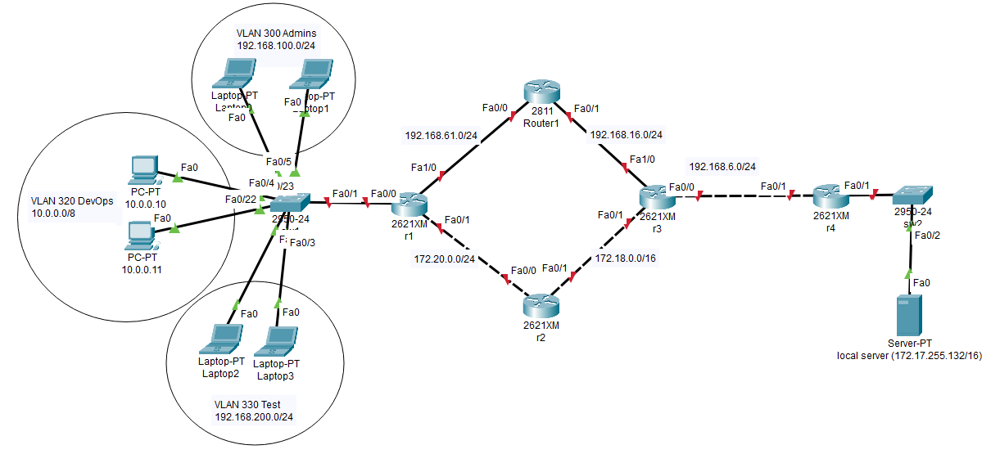

# Компьютерные сети (семинары)

## Урок 1. [Основы компьютерных сетей. Ethernet](seminar1/README.md)

Повторить то, что было на семинаре, либо выполнить следущие задания:

1. Починить сеть из [файла](https://gbcdn.mrgcdn.ru/uploads/asset/5564600/attachment/ba875d94245aa1272c90e934876e01a7.pkt), чтобы все линки были зеленые. Попинговать компьютеры.
— Сдать два скриншота успешного пинга с РС 10.0.0.1 на интерфейс сервера Fa0 10.0.0.5 и на PC 10.0.0.3.
— Сдать один скриншот успешного пинга с РС 10.0.0.2 на интерфейс сервера Fa1 10.0.0.6.

2. Посмотреть [ролик про Интернет](https://www.youtube.com/watch?v=XE_FPEFpHt4) (подсказка: яндекс браузер переводит на лету, но лучше смотреть с субтитрами и учить технический английский).

3. Повторить базовую терминологию, если где-то ошиблись в викторине.

## Урок 2. [Технология Ethernet. Протокол IP](seminar2/README.md)

1. Настроить сеть согласно схеме в файле.

2. Проверить работоспособность соседних между собой сетей командой ping.

3. Обвести синим все broadcast домены.

4. `*` Настроить loopback интерфейсы.

Скинуть скриншоты:

— с зелеными линками;

— успешные пинги между парой-тройкой соседних сетей (соседние сети - это Connected сети к одному роутеру);

— вывод любой таблицы ARP.

(Задание со * являются заданиями с повышенной сложностью и требуют самостоятельного изучения. Если они не выполнены, это не влияет на оценку).

## Урок 3. [Технология Ethernet. Протокол IP](seminar3/README.md)

1) Доделать статическую марширутизацию для сети 172.16.10.0, файл с семинара <https://disk.yandex.ru/d/Z5kbsNMuOt0hQA>

2) `*` сделать так, чтобы все интерфейсы пинговались отовсюду

Формат - сриншот с пингом

## Урок 4. [Основы компьютерных сетей. Сетевой уровень. Протоколы маршрутизации. `VLAN` -](seminar4/README.md)

Повторить то, что на семинаре, либо выполнить следущее задание:

1. Настроить сеть согласно схеме в файле с помощью `OSPF` и `VLAN`. Починить неработающие линки.

(скачать картинку <https://easyupload.io/zfdotb>)

2. Убедиться что трафик от компов до сервера ходит через два маршрута с помощью `IСМР`.

3. Скинуть скриншот с таблицей маршрутизации с r1. Должны быть сети Connected для VLAN’ов.

4. Поймать трейс на любом компе, когда он пойдет через r5. Удалить один из линков на r5. Снова сделать трейс, убедиться что трафик пошел по резервному пути. Скинуть скриншот с разными трейсами.

Скинуть еще один скриншот с изменившейся таблицей маршрутизации с r1.

## Урок 5. [Основы компьютерных сетей. Транспортный уровень. `UDP и TCP.`](seminar5/README.md)

Повторить то, что было на семинаре, или решить следущие задачи:

1. В приложенном файле <https://disk.yandex.ru/d/OtSDXQUWEFkGvg> “`The Ultimate PCAP.pcap`” (из раздаточного материала) найти `e-mail`. Что внутри письма и для кого оно?

2. Закрепите навыки фильтрования. Запустите трейс до `8.8.8.8`. И перехватите его в `Wireshark`. Проанализируйте.

3. Закрепите навыки фильтрования. Найдите еще один сайт без шифрования с возможностью ввода логина/пароля. (можно в гугл настроить соответствующую выдачу по запросу с ключом “`-inurl:https`” в конце). Перехватите их в Wiresharke, построив фильтр.

4. `*` Перед заданием прчоитать <https://habr.com/ru/company/billing/blog/252819/> На сайте <https://launchpad.net/ubuntu/+archivemirrors> представлены зеркала с образами Убунту по странам. Скачайте файл `ls-lR.gz` из Чили и с Яндекса. Снимите два дампа для каждого скачивания. Проанализируйте скорость скачивания и посмотрите `tcptrace`. Прикиньте средний `RTT` и поищите максимальный RWND для скачивающего.
Предоставить скриншоты графиков скорости и `tcptrace`. Есть ли разница? В чем она?

## Урок 6. [Основы компьютерных сетей. Транспортный уровень. `UDP и TCP.`](seminar6/README.md)

1. Напишите свою программу сервер и запустите её ([если опыта в python нет, запустите готовый код и разберитесь, как он работает — файл с кодом готового клиента, файл с кодом готового сервера](https://gbcdn.mrgcdn.ru/uploads/asset/5564624/attachment/caf6ce6b4f592706b8a5d933416f471a.py)).

    `**` попробуйте улучшить код, опишите что сделали, какие фичи добавили.

    Использовать локальный ip адрес 127.0.0.1 для сервера и клиента

2. Запустите несколько клиентов. Сымитируйте чат.

3. Отправьте мне код написанного сервера (можете через github, если удобно или прямо здесь в txt формате) и скриншоты работающего чата.

4. Отследите сокеты с помощью команды netstat (тоже пришлите скриншот именно сокетов вашего чата).

5. Перехватите трафик своего чата в Wireshark и cшейте сессию. Пришлите скриншот сшитой сессии с диалогом.

6. Посмотрите скринкаст с практикой перед следующим семинаром.

— [Практика NAT](https://gbcdn.mrgcdn.ru/uploads/asset/5564636/attachment/2b4d2a22f47c0372c2870d9556d3740d.mp4).

— [Практика GRE.](https://gbcdn.mrgcdn.ru/uploads/asset/5564638/attachment/707dc0fd1600f939dd994ca3f98ee137.mp4)

— [Установка OpenVPN.](https://gbcdn.mrgcdn.ru/uploads/asset/5564640/attachment/f9860bf407c4f3ec99141ed0170839b2.mp4)

Заведите себе машину в облаке, будем разбирать как работает VPN. Можно yandex cloud (2 мес бесплатно). Можно timeweb.cloud (188 р/мес). Или любую другую на ваш выбор.

## Урок 7. [`NAT. GRE.`](seminar7/README.md)

Повторить, то, что на семинаре (прототип решения `NAT` без ошибки на Сервер 2 или Сервер 0 <https://disk.yandex.com/d/y4oqlwUsi75Q5A> )

команды для `Cisco IOS` :
настройка `NAT` <https://disk.yandex.ru/d/wY_Ly8NzEuRv4A>
настройка `GRE` <https://disk.yandex.ru/d/ZQr58Z9D8kBtiQ>

1. Настроить сеть согласно схеме в файле, где:

   — `Office 1` — cеть 10.1.1.0/24

   — `Office 2` — cеть 10.0.0.0/16

   — `Office 3` — cеть 172.16.0.0/16

   — `Office 4` — cеть 192.168.145.0/24

   — Где “Интернет” — там имитация Интернета с помощью `OSPF`, выберите сами публичные сети между роутерами.

### Задача 1

Настроить на `Port Forwarding` на сервера в `Office 2`.

`Server0` должен предоставлять `HTTP` по 80-му порту, а `Server1` должен предоставлять `HTTPS` по 443 порту. Странички должны быть разные.

### Задача 2

 Настроить PAT в Office 3 для компьютеров, чтобы они выходили в интернет под одним публичным IP адресом на Router1.

Предоставить скриншот открытых страниц по `HTTP` и `HTTPS` по публичному адресу Router3 в веб-браузере клиентов Office3 (с РС1 и РС0);
После чего предоставить вывод

```bash
show ip nat translation
```

c Router1.

### Задача 3

Связать сети Office 1 и Office 4 с помощью `GRE`. Предоставит трейс с Laptop0 до Server2.

### Задача 4

(Не обязательно, требуется приобретение платного сервера) Настроить `OpenVPN`. Предоставить скриншот публичного IP до и после подключения через `VPN` + скриншот вывода команды `ip addr`.
Учтите что в `Yandex Cloud` есть два нюанса:

— если создавать прерываемую машину, то публичный адрес будет меняться после перезапуска;

— на машине Yandex делает приватный `IP`, но одновременно в виртуализации создается `Static NAT` 1:1 в ваш публичный `IP`.

### Задача 5

(Не обязательно, требуется приобретение платного сервера) Настроить веб сервер `Nginx`. Пример <https://www.digitalocean.com/community/tutorials/how-to-install-nginx-on-debian-9-ru> Повторить то

## Урок 8. [Основы HTTP/HTTPS и DNS](seminar8/README.md)

Повторить то, что делали на семинаре (и в подкасте <https://disk.yandex.ru/d/jwzMkCmFjV_87w>), либо решить следующие задания

### Задача 1`.`

Настроить сеть согласно информации на схеме.

— Сымитировать "Интернет" с помощью `OSPF`. Приватных сетей в маршрутизации быть не должно.

— Для компьютеров из `Office 1` предоставить доступ в "Интернет" с помощью `PAT`.

— Открыть доступ из "Интернета" к серверам из `Office 2` c помощью `Port Forwarding`.

— Для компьютеров из `Office 1` должны открываться разные сайты по `HTTP` и `HTTPS` из `Office 2` по одному доменному имени.

Предоставить скриншоты открытых разных сайтов по одному доменному имени.

Предоставить скриншот таблицы `NAT` трансляций с Router3.

Предоставить скриншот таблицы маршрутизации с `Router0`.

### Задача 2`.`

(Не обязательно, требуется приобретение сервера)

Добавить Let's Encrypt к OpenVPN

### Задача 3`.`

(Не обязательно, требуется приобретение сервера) Добавить `Let's Encrypt` к `Nginx`. Пример <https://habr.com/ru/articles/318952/>
