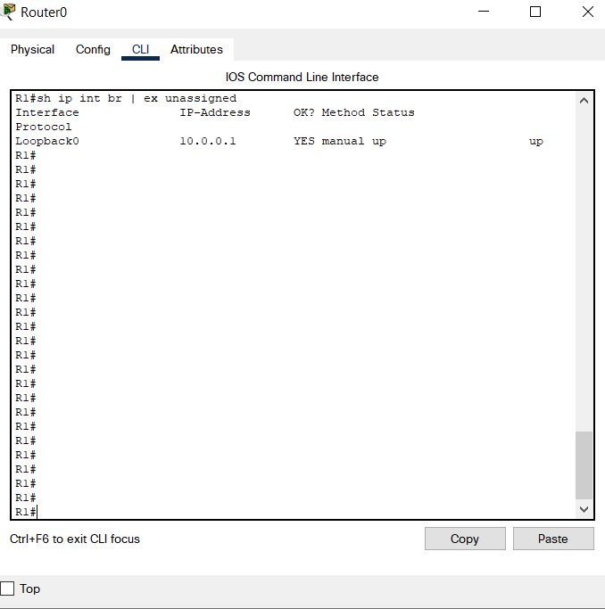

# Компьютерные сети (семинары)

## Урок 2. Технология Ethernet. Протокол IP

1. Настроить сеть согласно схеме в файле.

2. Проверить работоспособность соседних между собой сетей командой ping.

3. Обвести синим все broadcast домены.

4. `*` Настроить loopback интерфейсы.

Скинуть скриншоты:

— с зелеными линками;

— успешные пинги между парой-тройкой соседних сетей (соседние сети - это Connected сети к одному роутеру);

— вывод любой таблицы ARP.

(Задание со * являются заданиями с повышенной сложностью и требуют самостоятельного изучения. Если они не выполнены, это не влияет на оценку).

### Настройка интерфейса обратной связи в Cisco

Интерфейс обратной связи используется для идентификации устройства. Хотя вы можете использовать любой адрес интерфейса, чтобы определить, подключено ли устройство к сети, мы рекомендуем использовать адрес обратной связи. Изменения топологии сети могут привести к удалению интерфейсов или изменению адресов, но адрес обратной связи никогда не меняется.

### Использование интерфейса обратной связи

Он используется для протоколов маршрутизации, обеспечения доступности и тестирования.
Он также используется для идентификации устройства, в то время как физические почту также могут использоваться для идентификации устройства. Предпочтителен интерфейс обратной связи.
Такие протоколы, как OSPF, также используют интерфейс обратной связи для определения своих свойств

### Настройка интерфейса обратной связи на маршрутизаторе Cisco

Здесь вы можете выбрать любой маршрутизатор по своему вкусу из раздела "Маршрутизатор" в Cisco packet tracer. После выбора маршрутизатора откройте его CLI и выполните следующие шаги для настройки интерфейса обратной связи на маршрутизаторе:

```shell
interface loopback 0
ip  add 10.0.0.1 255.255.255.255
```


Проверка интерфейса обратной связи:

```shell
show interfaces loopback 0
```


```shell
sh ip interface brief | exclude unassigned
```



Примечание:
Интерфейс обратной связи по умолчанию отключен.
Интерфейс обратной связи не имеет MAC-адреса.

++++++++++++++++++++++++++++++++

### Команды для просмотра настроек

```shell
show ip route
```

- просмотр таблицы маршрутизации
  
```shell
show arp
```

- просмотр таблицы ARP (на роутерах)

```shell
show mac-address-table
```

- просмотр таблицы коммутации (на свичах)

```shell
arp -a
```

- просмотр таблицы ARP (на PC)
