# Компьютерные сети (семинары)

## Урок 3. Технология Ethernet. Протокол IP

1) Доделать статическую марширутизацию для сети 172.16.10.0, файл с семинара <https://disk.yandex.ru/d/Z5kbsNMuOt0hQA>

2) `*` сделать так, чтобы все интерфейсы пинговались отовсюду

Формат - сриншот с пингом

### Тренинг Cisco 200-125 CCNA v3.0. День 20. Статическая маршрутизация

Сегодня мы поговорим о статической маршрутизации и рассмотрим три темы: что такое статическая маршрутизация, как она настраивается и какая у неё альтернатива. Вы видите топологию сети, которая включает в себя компьютер с IP-адресом 192.168.1.10, подсоединенный через свитч к шлюзу, или роутеру. Для этого соединения используется порт роутера f0/0 с IP-адресом 192.168.1.1

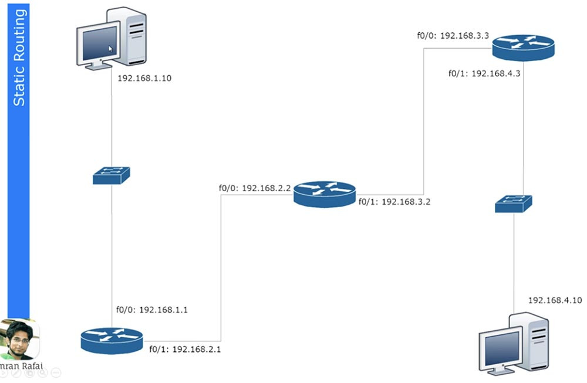

Второй порт этого роутера f0/1 с IP-адресом 192.168.2.1 подключен к порту f0/0 другого роутера, и этот интерфейс имеет адрес 192.168.2.2. Второй роутер соединен портом f0/1 с адресом 192.168.3.2 с третьим роутером, который использует для этого соединения порт f0/0 с IP-адресом 192.168.3.3

Наконец, третий роутер соединен со вторым свитчем через порт f0/1 с адресом 192.168.4.3, а свитч подсоединен ко второму компьютеру с IP-адресом 192.168.4.10.
Если вы знаете, как по IP-адресам можно разделить подсети, то определите, что участок от первого компьютера до первого роутера относится к одной подсети, участок межу первым и вторым роутером – ко второй сети, между вторым и третьим роутером – к третьей сети и между третьим роутером и вторым компьютером – к четвертой сети. Таким образом, у нас имеется 4 различных сети.

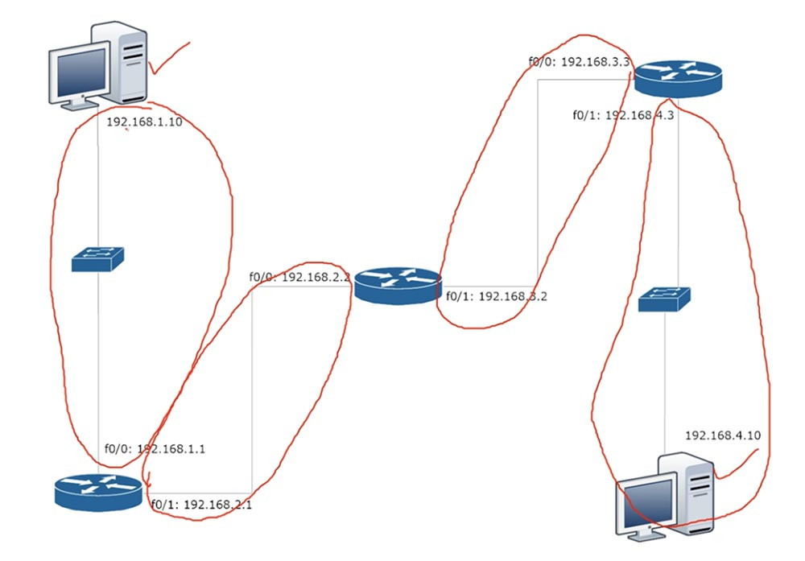

Если компьютер 192.168.1.10 хочет связаться с компьютером 192.168.4.10, то сначала он должен послать свои данные шлюзу 192.168.1.1. Он создает фрейм, в который помещает IP-адрес источника и назначения, MAC-адрес источника и назначения и отсылает его роутеру. Тот отбрасывает информацию 2-го уровня, то есть MAC-адреса, и смотрит на информацию 3-го уровня. Узнав, что данные адресованы устройству с IP-адресом 192.168.4.10, роутер понимает, что такое устройство к нему не подсоединено, поэтому он просто должен пропустить этот фрейм через себя дальше по сети. Он обращается к своей таблице маршрутизации и видит, что данные для сети 4. нужно посылать устройству с IP-адресом 192.168.2.2

Аналогично второй роутер сверяется со своей таблицей маршрутизации, узнает, что данные для сети 4. нужно отправить на IP-адрес 192.168.3.3, и отправляет фрейм третьему роутеру. Наконец, третий роутер сверяется со своей таблицей, определяет, что сеть 4. подсоединена к нему самому, и отправляет фрейм второму компьютеру.

Давайте рассмотрим, как создается таблица маршрутизации. Для этого используем Cisco Packet Tracer и посмотрим, как реализуется концепция роутинга. Здесь изображена та же топология сети, и сейчас я присвою роутерам соответствующие IP-адреса, указав также адреса шлюзов по умолчанию.

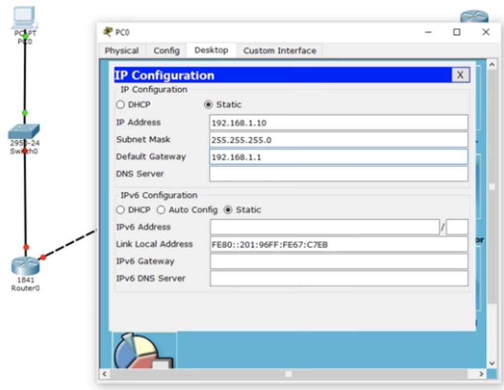

Мы ничего не делаем со свитчем, потому что он работает с настройками по умолчанию и использует VLAN1. Приступим к настройкам первого роутера Router0. Сначала присвоим ему имя хоста R1, после чего пропишем IP-адрес и маску подсети для интерфейса f0/0. Затем нужно применить команду no shutdown. Вы видите, как маркер интерфейса сменился с красного на зеленый, то есть порт включился в сеть.

Далее нам нужно настроить второй порт роутера f0/1, при этом имя хоста остается прежним, мы просто добавляем IP-адрес 192.168.2.1 и маску подсети 255.255.255.0. Здесь нет ничего нового, это простая настройка, вы уже знаете все команды, поэтому я быстро пробегусь по остальным роутерам. По мере того, как я буду присваивать IP-адреса и использовать команду no shut, порты роутеров будут изменять цвет на зеленый, показывая, что связь между устройствами установлена. При этом я создаю сети 1., 2., 3. и 4. Последний октет IP-адреса порта роутера указывает на номер самого роутера, а предпоследний октет – на номер сети, подключенной к этому порту.

Таким образом, у первого роутера адреса портов будут 192.168.1.1 (первый роутер, первая сеть) и 192.168.2.1 (первый роутер, вторая сеть), у второго роутера — 192.168.2.2 (второй роутер, вторая сеть) и 192.168.3.2 (второй роутер, третья сеть) и у третьего роутера — 192.168.3.3 (третий роутер, третья сеть) и 192.168.4.3 (третий роутер, четвертая сеть). По-моему, это довольно легко запомнить, однако в реальности адреса могут формироваться по-другому, в зависимости от правил, принятых в вашей компании. Вы должны придерживаться правил компании, потому что вашему коллеге будет легче устранять неисправности в вашей сети, если вы будете формировать ее в соответствии с правилами.

Итак, я закончил присваивать портам роутера IP-адреса, и вы видите, что порт второго свитча также поменял цвет на зеленый, так как соединение между ним и вторым компьютером создалось автоматически.

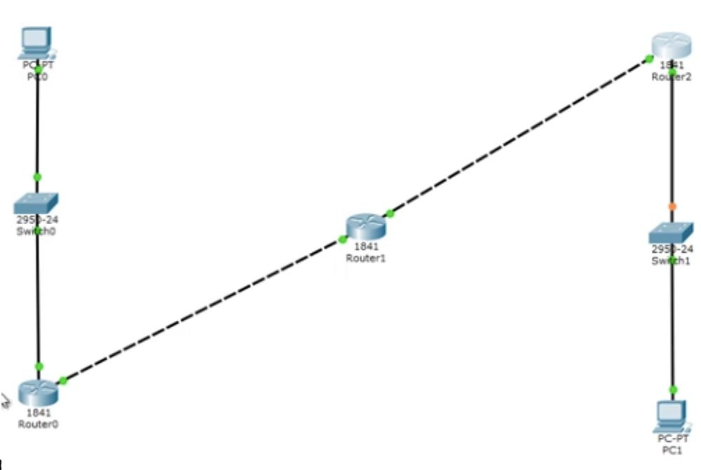

Теперь я вызову терминал командной строки первого компьютера и пропингую второй компьютер по адресу 192.168.4.10. Перейдем к режиму симуляции – теперь вы видите анимированное движение пакетов пинга по участкам сети. Сейчас я ещё раз запущу пингование, чтобы вы смогли внимательно посмотреть, что при этом происходит. Справа в таблице вы видите ICMP, Internet Control Message Protocol – так обозначается пинг. Пинг – это протокол, который мы используем для проверки соединения.

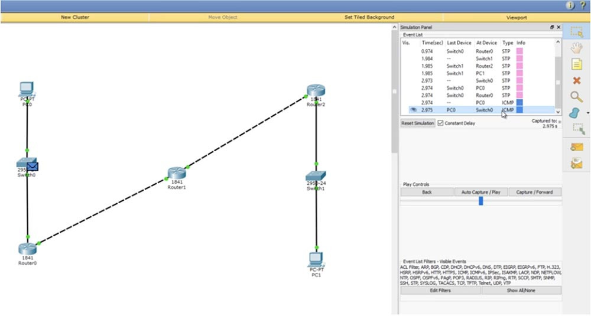

Вы посылаете тестовый пакет на другое устройство, и если оно его возвращает, то связь успешно установлена. Если щелкнуть по пакету пинга на схеме, можно посмотреть информацию о передаче.

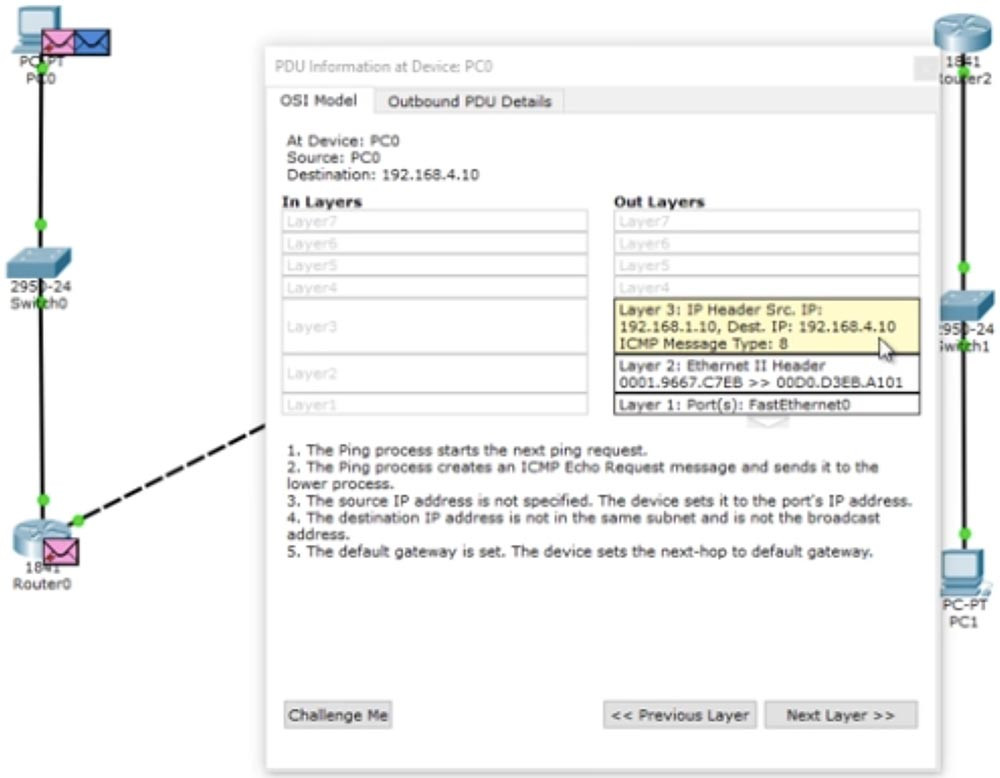

Вы видите данные 3 уровня OSI – это IP-адреса источника и назначения пинга, данные 2-го уровня в виде соответствующих MAC-адресов и данные 1-го уровня в виде обозначения порта (портов) – это FastEthernet0. Вы также можете взглянуть на формат фрейма пинга: заголовок, тип и тело пакета.

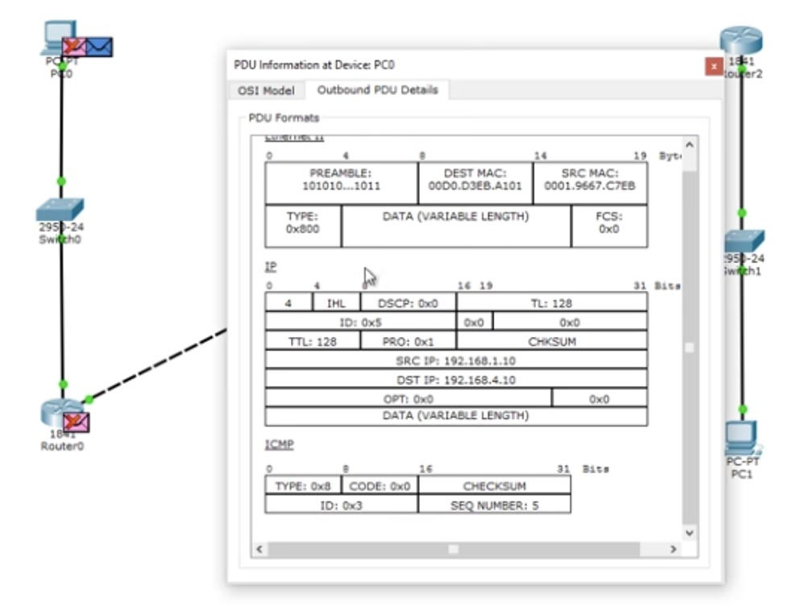

Фрейм направляется к свитчу, свитч анализирует MAC-адреса и отправляет его дальше по сети роутеру. Роутер видит IP-адрес 192.168.4.10 и отбрасывает пакет, потому что не знает такого адреса. Давайте посмотрим, что происходит в режиме реального времени, для чего вернемся к пингу в окне командной строки.

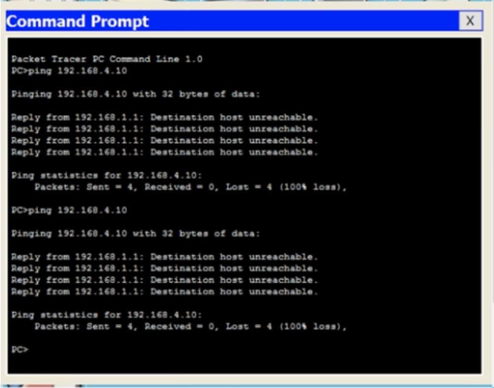

Вы видите, что попытке пропинговать компьютер 192.168.4.10 все 4 пакета были потеряны – от роутера 192.168.1.1 был получен ответ, что хост назначения не доступен. Вернемся в окно интерфейса командной строки роутера и введем команду show ip route. Вы видите самую важную часть – таблицу маршрутизации, а введенная мной команда это одна из основных команд роутинга Cisco. В настоящий момент эта таблица содержит 2 записи. В начале таблицы находится список используемых сокращений, из которого видно, что буквой С обозначаются соединения. Первая запись сообщает, что сеть 192.168.1.0/24 напрямую подсоединена к порту FastEthernet0/0, а сеть 192.168.2.0/24 напрямую подсоединена к порту FastEthernet0/1. Это значит, что в данный момент роутер знает только эти две сети.

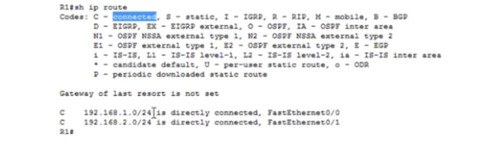

Значение 192.168.1.0/24 является идентификатором сети. Когда мы создавали подсети, мы одновременно создавали их идентификаторы. Эти идентификаторы говорят роутеру, что все устройства, IP-адреса которых находятся в диапазоне от 192.168.1.1 до 192.168.1.254, расположены в данной подсети. Таким образом, все эти устройства технически должны быть доступны для роутера, поскольку он подсоединен к данной сети.

Если в конце идентификатора расположено значение /24, это означает, что всем устройствам данной сети от 1 до 254-го будет рассылаться широковещательный запрос. Итак, к данному роутеру подсоединены только сети 1. и 2., поэтому он знает только об этих сетях. Поэтому когда пинг с адресом 192.168.4.10 попадает к роутеру, он не знает, что этот адрес доступен по маршруту Router0- Router1- Router2.

Но вы как администратор сети знаете, что этот маршрут доступен, то есть что первый роутер может отправить этот пакет второму роутеру. Поэтому вы должны организовать статическую маршрутизацию. Давайте попробуем это сделать.

Мы скажем этому роутеру, что любой пакет и любой трафик, предназначенный для сети 192.168.4.0/24, должен быть отправлен второму роутеру. Формат команды для назначения статической маршрутизации имеет такой вид: ip route <идентификатор сети> < IP-адрес маски подсети > < IP-адрес шлюза >.

Сейчас я покажу вам, что это означает. Мы используем для этой команды режим глобальной конфигурации настроек роутера. Я набираю ip route 192.168.4.0 255.255.255.0 – это означает, что сюда попадает любой трафик для устройств сети, чей IP-адрес имеет значение последнего октета от 1 до 254, и далее набираю либо IP-адрес, либо обозначение порта, куда должен отправляться этот трафик. В данном случае я набираю обозначение интерфейса f0/1, то есть команда приобретает такой вид: ip route 192.168.4.0 255.255.255.0 f0/1.

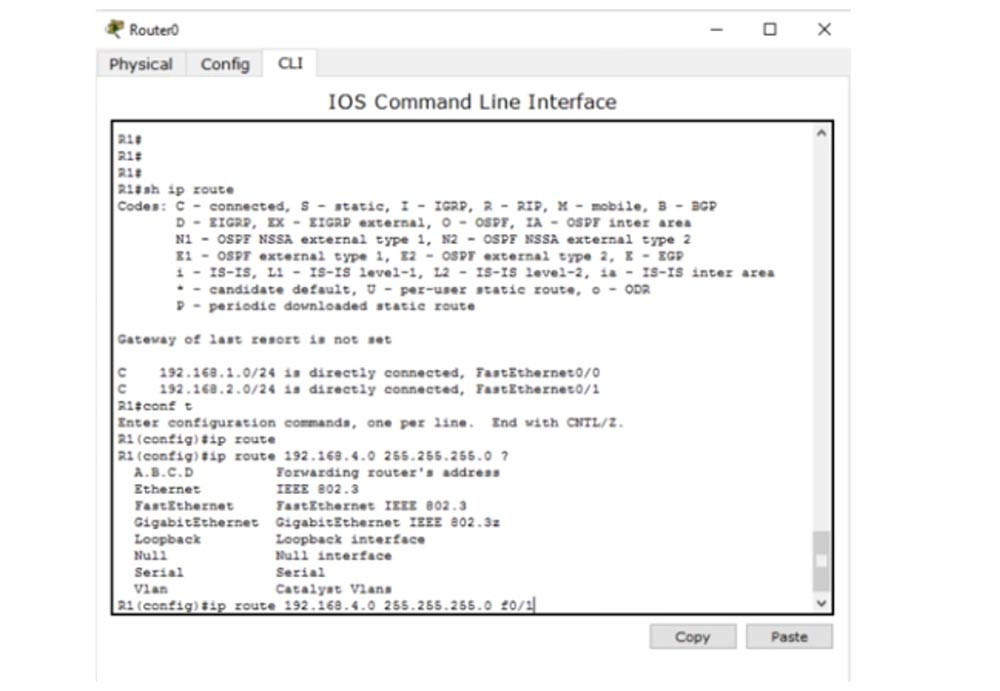

Вместо интерфейса шлюза я могу указать его IP-адрес, тогда команда статической маршрутизации будет выглядеть как ip route 192.168.4.0 255.255.255.0 192.168.2.2.

Вы можете спросить, что лучше. Я думаю, что для широковещательных сетей, таких, как Ethernet, лучше указывать IP-адрес. Если же вы используете сети типа «точка-точка», такие, как Frame Relay (сети с ретрансляцией, или коммутацией кадров), лучше использовать exit interface. Позже мы рассмотрим сети Frame Relay, сейчас же я использую более подходящий вариант команды маршрутизации -192.168.4.0 255.255.255.0.

Давайте теперь посмотрим на таблицу маршрутизации, использовав команду do show ip address. Вы видите, что в ней появилась новая запись, озаглавленная буквой S, то есть static.

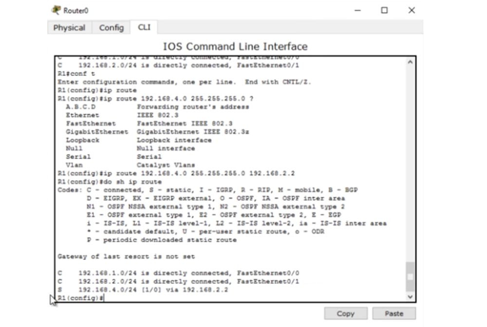

Эта запись говорит о том, что если имеется трафик для сети 192.168.4.0/24, его нужно пересылать адресату через устройство с IP-адресом 192.168.2.2. Вернемся к командной строке компьютера и пропингуем нужный адрес еще раз. Теперь трафик должен пройти через первый роутер и достигнуть второго роутера, который должен отбросить пакеты.

В первом случае роутер не просто отбросил пакеты, он еще и ответил компьютеру, что IP-адрес 192.168.4.10 недоступен. Однако второй роутер может ответить только первому роутеру, от которого получил трафик. Давайте посмотрим на таблицу маршрутизации второго роутера. Здесь сказано, что Router1 знает только сети 2. и 3. и ничего не знает о сети 4., куда он должен отправить пакеты первого компьютера. Он бы отправил назад сообщение, что хост назначения не доступен, но не знает, как связаться с компьютером, который послал эти пакеты, потому что ничего не знает о сети 1. Вот почему вместо сообщения о недоступности хоста назначения мы получили сообщение Request timed out – время ожидания запроса истекло. Различные сетевые устройства имеют различные значения TTL, поэтому, когда IP пакеты достигают этого значения, они уничтожаются. При этом происходит обратный отсчет – совершается один хоп, и счетчик TTL меняется с 16 до 15, второй – с 15 до 14 и так далее, пока значение TTL не достигнет 0 и пакет будет уничтожен.

Так работает механизм предотвращения зацикленности IP-пакетов. Таким образом, если устройство не получает запрос в установленное время, система выдаёт подобное сообщение. Поэтому давайте перейдем к настройкам второго роутера и покажем ему, как можно достичь четвертой подсети. Для этого я использую команду ip route 192.168.4.0 255.255.255.0 192.168.3.3. Теперь соответствующая запись появилась в таблице маршрутизации, которую мы вызвали командой do show ip route.

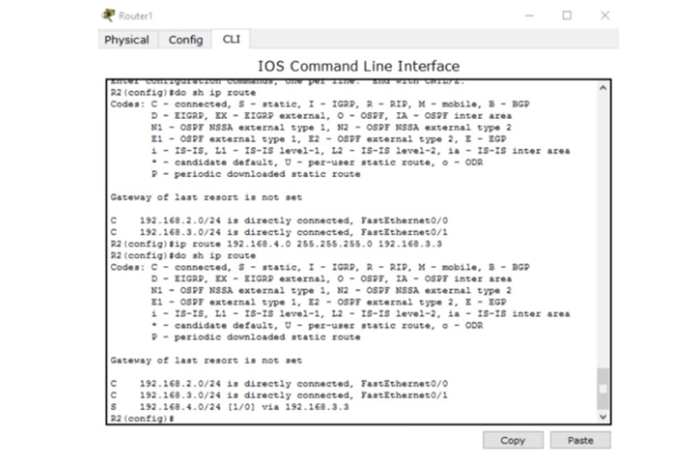

Теперь Router1 знает, как отправлять трафик адресатам четвертой подсети. Он отправляет его третьему роутеру. Третий роутер Router2, поскольку к нему подсоединена сеть 4., определенно знает, как отправить пакет второму компьютеру.

Что произойдет, если я еще раз отправлю пинг? Ведь теперь все сетевые устройства знают, как достичь второго компьютера. Будет ли теперь пингование IP-адреса 192.168.4.10 удачным? Нет, не будет!

Как я уже говорил, ICMP представляет собой протокол двусторонней коммуникации, поэтому, если кто-то посылает пакеты пинга, они должны вернуться обратно. Маршрутизация заключается в том, что каждое сетевое устройство должно не только знать, как отправить кому-либо сообщение, оно также должно знать, как доставить ответное сообщение отправителю запроса. Итак, пакет, отправленный первым компьютером, успешно достиг второго компьютера. Второй компьютер думает: «отлично, я получил ваше сообщение и теперь должен выслать вам ответ». Этот ответ, адресованный устройству с IP-адресом 192.168.1.10, добирается до роутера Router2. Третий роутер видит, что должен отправить пакет в первую подсеть, но в его таблице маршрутизации есть записи только о третьей и четвертой подсети. Поэтому мы должны создать статический маршрут с помощью команды ip route 192.168.1.0 255.255.255.0 192.168.3.2. Данная команда говорит, что трафик, предназначенный для сети с идентификатором 192.168.1.0 должен быть отправлен второму роутеру с IP-адресом 192.168.3.2.

Что произойдет после этого? Второй роутер знает про сети 2., 3. и 4., но ничего не знает о первой сети. Поэтому нужно зайти в настройки второго роутера Router1 и использовать команду ip route 192.168.1.0 255.255.255.0 192.168.2.1, то есть указать, что трафик для сети 1. должен быть отправлен по сети 2. первому роутеру Router0.

После этого пакет достигает первого роутера, который знает об устройстве 192.168.1.10, потому что первая сеть, в которой находится этот компьютер, подключена к порту этого роутера. Замечу, что теперь первый роутер ничего не знает о сети 3., а третий роутер ничего не знает о второй сети. Это может создать проблему, потому что эти роутеры не знают о существовании промежуточных подсетей.

Я еще раз пингую адрес 192.168.4.0, и вы видите, что на этот раз пингование прошло успешно. Пакеты прошли весь путь от первого до второго компьютера и ответ вернулся отправителю. В окне командной строки видно сообщение о том, что каждый из 4-х ответных пакетов 192.168.4.0 представляет собой 32 байта, TTL= 125 мс, и успешность пинга составляет 100%. Это означает, что источник передачи получил ответ от хоста назначения. Таким образом, даже если устройства не знают о существовании некоторых промежуточных сетей, это не имеет значения, если они работают по принципу «конечный отправитель – конечный получатель». Первый компьютер знает, как добраться до второго компьютера, а второй – как добраться до первого.

Давайте рассмотрим другую ситуацию. Итак, первый компьютер может успешно общаться со вторым компьютером, при этом трафик проходит через все эти устройства. Посмотрим, сможет ли PC0 связаться с третьим роутером Router2 по адресу 192.168.3.3 – это порт сети 3 третьего роутера. Пинг показывает, что это невозможно – хост назначения недоступен.

Посмотрим, в чем причина. Открыв таблицу маршрутизации первого роутера, мы видим, что он знает только 3 сети – первую, вторую и четвертую, но ничего не знает о третьей сети. Поэтому, если я хочу связаться с этой сетью, для неё нужно задать статический маршрут.

Итак, мы рассмотрели, как можно настроить статическую маршрутизацию для трех роутеров. Если у вас имеется 10 роутеров и 50 различных подсетей, ручная настройка статической маршрутизации займет очень много времени. Вот зачем нам нужна динамическая маршрутизация.
Сейчас я удалю все маршруты, которые создал. Для этого я поочередно вызову таблицы маршрутизации всех роутеров и допишу слово «no» в начале каждой записи статической маршрутизации, то есть использую команду отрицания. Теперь мы можем рассмотреть, что представляет собой динамическая маршрутизация.

Для динамической маршрутизации я должен активировать протокол RIP, это очень быстрый протокол. Но сегодня мы не будем обсуждать RIP, наша тема – это статическая маршрутизация, и я хотел показать вам, насколько это кропотливое и утомительное дело. Я все же быстро продемонстрирую вам, как работает RIP, который мы подробно рассмотрим на следующем уроке.
На примере первого роутера я использую команду router rip, затем введу ver 2, чтобы указать версию протокола, и затем отдельными строками перечислю сети, для которых нужно использовать протокол динамической маршрутизации: 192.168.1.0, 192.168.2.0, после чего перейду ко второму роутеру и поступлю с ним аналогично. Технически я просто указываю сети, которые подключены к данному устройству, поэтому для второго роутера я укажу 192.168.2.0 и 192.168.3.0, а для третьего после команды rip ver 2 – адреса 192.168.3.0 и 192.168.4.0. Затем я вернусь к первому роутеру и посмотрю на таблицу маршрутизации.

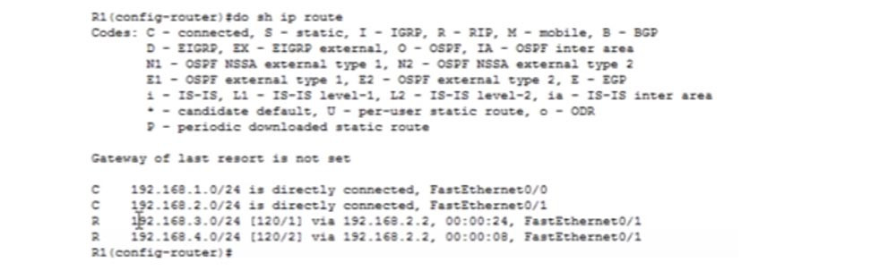

Вы видите, что в ней волшебным образом появились все сети, две первые – это те, что подсоединены непосредственно к роутеру, а две остальные – те, связь с которыми осуществляется по протоколу динамической маршрутизации RIP. Аналогичная ситуация наблюдается в таблицах маршрутизации второго и третьего роутеров. Если я подсоединю ко второму роутеру сети 5. и 6., то все устройства, использующие RIP, будут знать об этих новых сетях. Вот в чем заключается преимущество динамической маршрутизации.

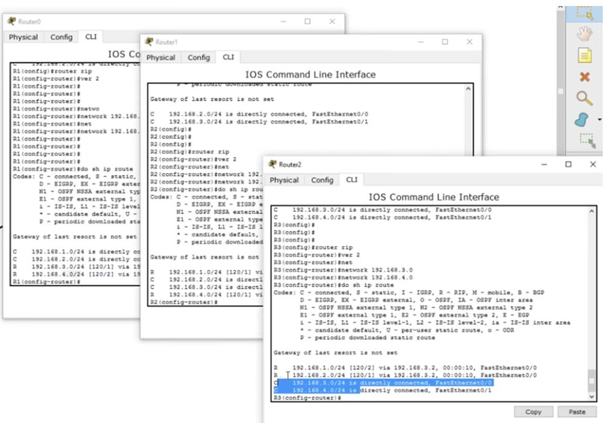

Если я сейчас пропингую второй компьютер, связь будет работать без проблем. Я могу пропинговать третий роутер, и пинг будет успешным, потому что первый роутер благодаря RIP знает обо всех устройствах всех сетей. Аналогичным «знанием» будут обладать второй и третий роутеры. Я не говорю, что RIP самый лучший протокол, но он способен эффективно выполнять множество вещей. Пока что я просто хочу, чтобы вы поняли, что такое маршрутизация и как она работает, что такое таблица маршрутизации и в чем заключено её значение.

Независимо от того, используете вы статическую или динамическую маршрутизацию, роль протоколов заключается в том, чтобы заполнить таблицу маршрутизации. Эта таблица должна знать обо всех маршрутах ко всем устройствам сети, чтобы одно устройство могло установить соединение с другим устройством.

Итак, сегодня вы узнали, что маршрутизация – это процесс, обеспечивающий появление записей о маршрутах в таблицах маршрутизации для того, чтобы роутер мог принять решение об отправке трафика по сети.
