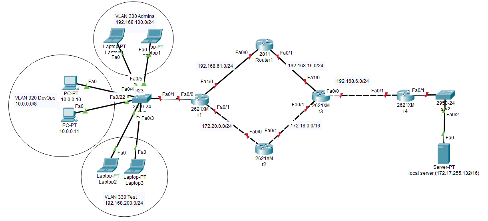

# Компьютерные сети (семинары)

## Урок 4. Основы компьютерных сетей. Сетевой уровень. Протоколы маршрутизации. `VLAN` -

Повторить то, что на семинаре, либо выполнить следущее задание:

1. Настроить сеть согласно схеме в файле с помощью `OSPF` и `VLAN`. Починить неработающие линки.

(скачать картинку <https://easyupload.io/zfdotb>)

2. Убедиться что трафик от компов до сервера ходит через два маршрута с помощью `IСМР`.

3. Скинуть скриншот с таблицей маршрутизации с r1. Должны быть сети Connected для VLAN’ов.

4. Поймать трейс на любом компе, когда он пойдет через r5. Удалить один из линков на r5. Снова сделать трейс, убедиться что трафик пошел по резервному пути. Скинуть скриншот с разными трейсами.

Скинуть еще один скриншот с изменившейся таблицей маршрутизации с r1.

### `CCNP CURSES`

(`OSPF` в Cisco IOS: <https://net-cheatsheets.gitbook.io/ccnp/ccnp-route/15.-ospf-v-cisco-ios>)

### `OSPF` На роутере -

`router ospf 123` - включение `OSPF` процесса на роутре

`router-id 12.12.12.12` - назаначение Router-ID на роутере

`network 1.1.1.0 0.0.0.255 area 0` - включение сети 1.1.1.0/24 в `OSPF` процесс в area 0 (соответственно и интерфейс из этой сети включается в процесс `OSPF`)

### Команды для `show` -

`show ip ospf int (brief)` - просмотр интерфейсов, включенных в OSPF процесс

`show ip ospf nei` - просмотр соседей по `OSPF`

`sh ip route ospf` - просмотр маршрутов, заинсталлированных в таблицу маршрутизации по протоколу `OSPF`

### `VLAN` на коммутаторе -

`vlan 330` - создание влана 330

`name TEST` - даем название влану

```bash
Switch(config)#vlan 300
Switch(config-vlan)# name Admins
Switch(config-vlan)#vlan 320
Switch(config-vlan)# name DevOps
Switch(config-vlan)#vlan 330
Switch(config-vlan)# name Test
Switch(config-vlan)#
Switch(config-vlan)#end
Switch# 
```

!

`interface FastEthernet0/1` - настройка порта в режиме Access с вланом 10

`switchport access vlan 10`

`switchport mode access`

!

`interface GigabitEthernet0/1` - настройка порта в режиме Trunk с вланом 10 и 20

`switchport trunk allowed vlan 10,20`

( `switchport trunk allowed vlan add, remove`) - добавить, удалить влан из списка

`switchport mode trunk`

### `VLAN` на роутере -

`interface GigabitEthernet0/0/0.10` - создание подынтерфейса на порту GigabitEthernet0/0/0 с ID 10.

`encapsulation dot1Q 10` - включение подынтерфейса GigabitEthernet0/0/0.10 во влан 10.

`no ip address`

!

`interface GigabitEthernet0/0/0.20` - создание подынтерфейса на порту GigabitEthernet0/0/0 с ID 20.

`encapsulation dot1Q 20` - включение подынтерфейса GigabitEthernet0/0/0.10 во влан 20.

`no ip address` - (не забывайте назначить IP адрес)

#### Команды для `show`

```bash
Switch# sh vlan

Switch# sh int gigabitEthernet 0/1 switchport
```

`VLAN` на коммутаторе

```bash
Switch(config)#int fa0/2
Switch(config-if)#
Switch(config-if)#
Switch(config-if)#
Switch(config-if)#sw
Switch(config-if)#switchport acc
Switch(config-if)#switchport access vl
Switch(config-if)#switchport access vlan 300
Switch(config-if)#sw
Switch(config-if)#switchport mo
Switch(config-if)#switchport mode acc
Switch(config-if)#switchport mode access 
Switch(config-if)#ex
Switch(config)#int fa0/3
Switch(config-if)#switchport access vlan 300
Switch(config-if)#switchport mode access 
Switch(config-if)#ex
Switch(config)#int fa0/4
Switch(config-if)#switchport access vlan 320
Switch(config-if)#switchport mode access 
Switch(config-if)#ex
Switch(config)#int fa0/5
Switch(config-if)#switchport access vlan 320
Switch(config-if)#switchport mode access 
Switch(config-if)#ex
Switch(config)#int fa0/6
Switch(config-if)#switchport access vlan 330
Switch(config-if)#switchport mode access 
Switch(config-if)#ex
Switch(config)#int fa0/7
Switch(config-if)#switchport access vlan 330
Switch(config-if)#switchport mode access 
Switch(config-if)#ex
Switch(config)#int fa0/1
Switch(config-if)#sw
Switch(config-if)#switchport tr
Switch(config-if)#switchport trunk all
Switch(config-if)#switchport trunk allowed vlan 300,320,330
Switch(config-if)#switchport mode tr
Switch(config-if)#switchport mode trunk 
Switch(config-if)#ex
Switch(config)#ex
Switch#
%SYS-5-CONFIG_I: Configured from console by console

Switch#sh vlan

VLAN Name                             Status    Ports
---- -------------------------------- --------- -------------------------------
1    default                          active    Fa0/1, Fa0/8, Fa0/9, Fa0/10
                                                Fa0/11, Fa0/12, Fa0/13, Fa0/14
                                                Fa0/15, Fa0/16, Fa0/17, Fa0/18
                                                Fa0/19, Fa0/20, Fa0/21, Fa0/22
                                                Fa0/23, Fa0/24
300  Admins                           active    Fa0/2, Fa0/3
320  DevOps                           active    Fa0/4, Fa0/5
330  Test                             active    Fa0/6, Fa0/7
1002 fddi-default                     active    
1003 token-ring-default               active    
1004 fddinet-default                  active    
1005 trnet-default                    active    

VLAN Type  SAID       MTU   Parent RingNo BridgeNo Stp  BrdgMode Trans1 Trans2
---- ----- ---------- ----- ------ ------ -------- ---- -------- ------ ------
1    enet  100001     1500  -      -      -        -    -        0      0
300  enet  100300     1500  -      -      -        -    -        0      0
320  enet  100320     1500  -      -      -        -    -        0      0
330  enet  100330     1500  -      -      -        -    -        0      0
1002 fddi  101002     1500  -      -      -        -    -        0      0   
1003 tr    101003     1500  -      -      -        -    -        0      0   
1004 fdnet 101004     1500  -      -      -        ieee -        0      0   
1005 trnet 101005     1500  -      -      -        ibm  -        0      0   

VLAN Type  SAID       MTU   Parent RingNo BridgeNo Stp  BrdgMode Trans1 Trans2
---- ----- ---------- ----- ------ ------ -------- ---- -------- ------ ------

Remote SPAN VLANs
------------------------------------------------------------------------------

Primary Secondary Type              Ports
------- --------- ----------------- ------------------------------------------
Switch#
```

`VLAN` на роутере

```bash
Router>enable
Router#
Router#configure terminal
Enter configuration commands, one per line.  End with CNTL/Z.
Router(config)#interface FastEthernet1/0
Router(config-if)#interface FastEthernet1/0.300
Router(config-subif)#encapsulation dot1Q 300
Router(config-subif)#ip add 192.168.0.1 255.255.255.0
Router(config-subif)#ex
Router(config)#interface FastEthernet1/0.320
Router(config-subif)#encapsulation dot1Q 320
Router(config-subif)#ip add 10.0.0.1 255.0.0.0
Router(config-subif)#ex
Router(config)#interface FastEthernet1/0.330
Router(config-subif)#encapsulation dot1Q 330
Router(config-subif)#ip add 192.168.200.1 255.255.255.0
Router(config-subif)#ex
Router(config)#interface FastEthernet1/0.300
Router(config-subif)#no ip add 192.168.0.1 255.255.255.0
Router(config-subif)#ip add 192.168.100.1 255.255.255.0
Router(config-subif)#
Router(config-subif)#
Router(config-subif)#end
Router#configure terminal
Enter configuration commands, one per line.  End with CNTL/Z.
Router(config)#interface FastEthernet1/0
Router(config-if)#no shutdown
Router(config-if)#
%LINK-5-CHANGED: Interface FastEthernet1/0, changed state to up

%LINEPROTO-5-UPDOWN: Line protocol on Interface FastEthernet1/0, changed state to up

%LINK-5-CHANGED: Interface FastEthernet1/0.300, changed state to up

%LINEPROTO-5-UPDOWN: Line protocol on Interface FastEthernet1/0.300, changed state to up

%LINK-5-CHANGED: Interface FastEthernet1/0.320, changed state to up

%LINEPROTO-5-UPDOWN: Line protocol on Interface FastEthernet1/0.320, changed state to up

%LINK-5-CHANGED: Interface FastEthernet1/0.330, changed state to up

%LINEPROTO-5-UPDOWN: Line protocol on Interface FastEthernet1/0.330, changed state to up
```
