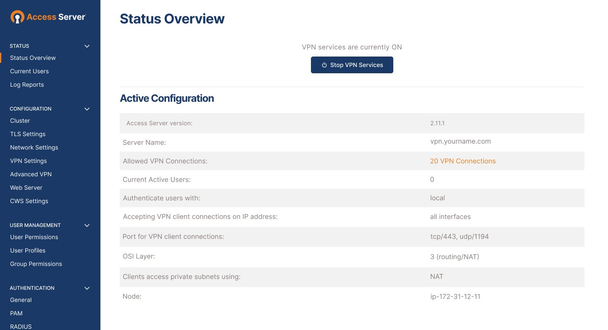

# Компьютерные сети (семинары)

## Урок 7. `NAT. GRE.`

Повторить, то, что на семинаре (прототип решения `NAT` без ошибки на Сервер 2 или Сервер 0 <https://disk.yandex.com/d/y4oqlwUsi75Q5A> )

команды для `Cisco IOS` :
настройка `NAT` <https://disk.yandex.ru/d/wY_Ly8NzEuRv4A>
настройка `GRE` <https://disk.yandex.ru/d/ZQr58Z9D8kBtiQ>

1. Настроить сеть согласно схеме в файле, где:

   — `Office 1` — cеть 10.1.1.0/24

   — `Office 2` — cеть 10.0.0.0/16

   — `Office 3` — cеть 172.16.0.0/16

   — `Office 4` — cеть 192.168.145.0/24

   — Где “Интернет” — там имитация Интернета с помощью `OSPF`, выберите сами публичные сети между роутерами.

## Задача 1

Настроить на `Port Forwarding` на сервера в `Office 2`.

`Server0` должен предоставлять `HTTP` по 80-му порту, а `Server1` должен предоставлять `HTTPS` по 443 порту. Странички должны быть разные.

## Задача 2

 Настроить PAT в Office 3 для компьютеров, чтобы они выходили в интернет под одним публичным IP адресом на Router1.

Предоставить скриншот открытых страниц по `HTTP` и `HTTPS` по публичному адресу Router3 в веб-браузере клиентов Office3 (с РС1 и РС0);
После чего предоставить вывод

```bash
show ip nat translation
```

c Router1.

## Задача 3

Связать сети Office 1 и Office 4 с помощью `GRE`. Предоставит трейс с Laptop0 до Server2.

## Задача 4

(Не обязательно, требуется приобретение платного сервера) Настроить `OpenVPN`. Предоставить скриншот публичного IP до и после подключения через `VPN` + скриншот вывода команды `ip addr`.
Учтите что в `Yandex Cloud` есть два нюанса:

— если создавать прерываемую машину, то публичный адрес будет меняться после перезапуска;

— на машине Yandex делает приватный `IP`, но одновременно в виртуализации создается `Static NAT` 1:1 в ваш публичный `IP`.

## Задача 5

(Не обязательно, требуется приобретение платного сервера) Настроить веб сервер `Nginx`. Пример <https://www.digitalocean.com/community/tutorials/how-to-install-nginx-on-debian-9-ru> Повторить то

**************

## Запустите сервер доступа `OpenVPN` на `Ubuntu 22.04.`

1. Установите обновления и установите правильное время.

2. Установите `OpenVPN Access Server` из репозитория программного обеспечения.

3. Обратите внимание на доступ к веб-интерфейсу и учетные данные для входа.

4. Завершите настройку и настройте пользователей в веб-интерфейсе.

## Настройка сервера доступа `OpenVPN` в `Ubuntu`

Сервер доступа `OpenVPN` идеально подходит для `Ubuntu`. Хранилище программного обеспечения `OpenVPN Access Server` предоставляет вам следующие три компонента:

- Популярное программное обеспечение `VPN`-сервера `OpenVPN` с открытым исходным кодом.
- Удобный и интуитивно понятный веб-интерфейс.
- Клиентское программное обеспечение для `Windows`, `macOS`, `Android`, `iOS` и `Linux`.

## 1. Установите обновления и установите правильное время

Мы рекомендуем вам начать с обновления вашей операционной системы до последней версии и убедиться, что время ее установки правильное:

1. Войдите в свою систему `Linux` на консоли или по `SSH` и получите права `root`.

2. Выполните приведенные ниже команды для установки обновлений и вызовите запрос на перенастройку настроек часового пояса.

```bash
apt update
apt upgrade
apt install tzdata
dpkg-reconfigure tzdata
```

**Примечание:** Мы предполагаем, что в вашей операционной системе есть инструмент синхронизации времени для обеспечения правильной даты и времени. Если это не так, вы должны убедиться в их правильности и рассмотреть возможность установки клиентской программы `Network Time Protocol (NTP)` для сохранения точного времени на вашем сервере. Сервер доступа использует точное время для одноразовых паролей на основе времени для многофакторной аутентификации и управления сертификатами.

## 2. Установите OpenVPN Access Server из репозитория программного обеспечения

Если консоль или сеанс `SSH` все еще открыты, добавьте репозиторий программного обеспечения `OpenVPN Access Server` в свою операционную систему и установите необходимое программное обеспечение:

1. Перейдите по ссылке ниже и следуйте инструкциям для вашей операционной системы.
Убедитесь, что вы выбрали правильную операционную систему и версию.

2. Затем скопируйте и вставьте инструкции на свой сервер, чтобы установить пакет openvpn-as и завершить установку.

- Инструкции по установке Ubuntu

**Примечание**: Мы поддерживаем только версии `Ubuntu LTS`. Если ваша версия операционной системы не указана в списке той, которую мы поддерживаем, не продолжайте, так как команды, скорее всего, завершатся ошибкой.

## 3. Обратите внимание на доступ к веб-интерфейсу и учетные данные для входа

После установки пакета **openvpn-as** обратите внимание на интерфейс администратора и адреса клиентского интерфейса, а также случайно сгенерированный пароль для вашего администратора **openvpn**. Они отображаются на экране, аналогичном этому примеру:

```bash
+++++++++++++++++++++++++++++++++++++++++++++++ 
Сервер доступа 2.11.3 успешно установлен в /usr/local/openvpn_as
Файл журнала конфигурации записан в /usr/local/openvpn_as/init.log

Веб-интерфейсы сервера доступа доступны здесь:
Интерфейс администратора: https://192.168.102.130:943/admin
Интерфейс клиента: https://192.168.102.130:943 
Войдите в систему как "openvpn" с помощью "RandomPassword", чтобы продолжить 
(пароль можно изменить в интерфейсе администратора)
+++++++++++++++++++++++++++++++++++++++++++++++
```

## 4. Завершите настройку и настройте пользователей в веб-интерфейсе

Используя информацию из предыдущего шага, подключитесь к веб-интерфейсу администратора и войдите в систему с помощью пользователя и пароля **openvpn**.

Например: `https: //адрес/admin/`
(замените `адрес` на `IP` или `DNS`-имя хоста вашего сервера)

Веб-интерфейс администратора сервера доступа предоставляет интуитивно понятный инструмент для управления настройками сервера доступа `OpenVPN`. Но при первом доступе к нему вы получите предупреждение о том, что безопасность или приватность веб-сайта определить невозможно. Это ожидаемо. `Access Server` поставляется с самозаверяющим ненадежным `SSL`-сертификатом, чтобы веб-служба могла функционировать. Вы можете переопределить это предупреждающее сообщение и продолжить. Мы рекомендуем вам настроить действительное `DNS`-имя хоста для вашего сервера Access и установить действительный подписанный `SSL`-сертификат, чтобы устранить это сообщение.



Для получения более подробной информации об этом шаге обратитесь к Завершающей настройке сервера доступа.

### Рекомендуемые следующие шаги

- Настройте `DNS`-имя хоста для вашего сервера
- Установите действительный подписанный `SSL`-сертификат
- Настройка параметров `VPN`
- Настройка пользователей
- Дополнительные меры безопасности

### Советы по установке

Чтобы связаться с сервером доступа OpenVPN через Интернет, задайте имя хоста или IP-адрес, обращенный к общедоступному Интернету. Если вы настроили свой сервер в частной сети, он может использовать частный IP-адрес, до которого невозможно добраться из Интернета. Вы можете изменить это, настроив `DNS`-имя хоста, которое преобразуется в общедоступный IP-адрес, по которому можно связаться с вашим сервером доступа, и настроив это в веб-интерфейсе администратора. При условии, что открыты нужные порты, ваши `VPN`-клиенты могут связаться с сервером Access из-за пределов вашей частной сети. Установка `DNS`-имени хоста также позволяет вам установить действительный подписанный SSL-сертификат, соответствующий этому `DNS`-имени хоста.

Подсеть по умолчанию для внутренней `VPN`-подсети сервера доступа `OpenVPN - 172.27.224.0/20`. Вы можете изменить подсеть на ту, которая лучше подходит для вашей текущей сети.

## Клиент `OpenVPN Connect`

На клиентских устройствах `VPN` должна быть установлена программа, например `OpenVPN Connect`, для установления `VPN`-соединения с сервером Access. Необходимое программное обеспечение и сведения о подключении можно получить в пользовательском интерфейсе клиента. Это тот же адрес, что и веб-интерфейс администратора, за вычетом части `/admin`.

Например: `https: //адрес/`
(замените `адрес` на IP или DNS-имя хоста вашего сервера)

Пользователи могут входить в систему со своими учетными данными и получать все необходимое клиентское программное обеспечение и конфигурацию для подключения к вашему серверу доступа `OpenVPN`.

## Полезные советы по `Linux`

Для успешного выполнения приведенных здесь команд `Linux` требуется выполнить их с правами `root`, вошедшими в систему как пользователь `root` или `sudo` up.
По умолчанию нелицензионный сервер разрешает только два подключения. Вы можете приобрести лицензию на программное обеспечение, чтобы увеличить это количество.
Лицензирование сервера `Access` без доступа в Интернет требует обращения в службу поддержки OpenVPN для процедуры автономной активации.
Если вы испытываете проблемы с веб-интерфейсом или активацией лицензионного ключа, убедитесь, что разрешение `DNS` работает должным образом.


******************:

### [Ubuntu 22, x86_64](https://as-portal.openvpn.com/instructions/ubuntu/installation)

Для установки `Access Server` используйте официальный репозиторий. Войдите в свою систему `Linux` с правами `root` и введите эти команды, чтобы добавить репозиторий и установить пакет "`openvpn-as`". Клиентский пакет устанавливается автоматически.

```bash
apt update && apt -y install ca-certificates wget net-tools gnupg
```

```bash
wget https://as-repository.openvpn.net/as-repo-public.asc -qO /etc/apt/trusted.gpg.d/as-repository.asc
```

```bash
echo "deb [arch=amd64 signed-by=/etc/apt/trusted.gpg.d/as-repository.asc] http://as-repository.openvpn.net/as/debian jammy main">/etc/apt/sources.list.d/openvpn-as-repo.list
```

```bash
apt update && apt -y install openvpn-as
```

<style>
g { color: Green }
</style>

- <g> После выполнения этих действий ваш сервер доступа должен быть установлен и ожидать дальнейшей настройки.</g>
